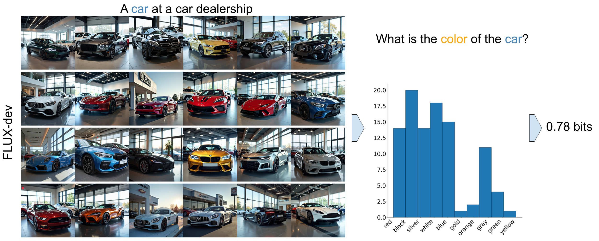

# GRADE: Assessing Output Diversity in Text-to-Image Models

We introduce **GRADE**, a method for assessing the output diversity of images generated by text-to-image (T2I) models. Leveraging Large Language Models (LLMs) and Visual Question Answering (Visual-QA) systems, GRADE quantifies diversity across concept-specific attributes by estimating attribute distributions and calculating normalized entropy.

In the [paper](https://arxiv.org/abs/2410.22592), our findings reveal substantial homogeneity in T2I outputs, with low diversity observed across all 12 models tested. Surprisingly, larger and more prompt-adherent models exhibit reduced diversity. We hypothesize that this low diversity stems from reporting bias in the training data. Additionally, we demonstrate that the diversity in the LAION dataset closely corresponds to the diversity of Stable Diffusion 1 and 2 models, which were trained on it.

#### Project Links

- [**Project website with interactive results**](https://royira.github.io/GRADE/)
- [**Paper**](https://arxiv.org/abs/2410.22592)
  
#### Quantifying a distribution with normalized entropy




### Installation

To use GRADE for assessing the diversity of your text-to-image model outputs, follow these steps:


1. **Install Dependencies:**

    ```bash
    pip install -r requirements.txt
    ```

2. **Set Up OpenAI API Key**

   Since GRADE utilizes OpenAI's GPT models, you need an OpenAI API key to use it.

   - Create a file named `oai_key.txt` in the base directory of the project.
   - Paste your OpenAI API key into this file.


### Step-by-Step Guide

#### 1. Prepare Your Concepts or Dataset

You can either provide a list of concepts or use an existing dataset.

- **Option A: Provide Concepts**

  Create a text file containing the concepts you wish to evaluate. Each concept should be on a new line.

  **Example (`concepts.txt`):**

  ```
  a cookie
  an ice cream
  a helmet
  a tree
  ```

- **Option B: Use an Existing Dataset**

  If you already have a dataset of prompts, attributes (questions), and attribute values, place it in the `datasets/` directory and ensure it's in CSV format (`your_dataset_name.csv`).

#### 2. Run the GRADE Pipeline

Use the `grade.py` script to process your concepts or dataset.

  ```bash
  python grade.py [arguments]
  ```

- **Arguments**

  - `--model_name`: (Required) The name of the text-to-image model to assess. Default choices are:
    - `'sdxl'`, `'sdxl-turbo'`, `'sd-1.4'`, `'sd-2.1'`, `'lcm-sdxl'`, `'deepfloyd-xl'`, `'deepfloyd-l'`, `'deepfloyd-m'`, `'sd-3'`, `'sd-1.1'`, `'flux-schnell'`, `'flux-dev'`.
  - `--concepts_path`: Path to your concepts file (use if you chose Option A).
  - `--dataset_name`: Name of your dataset (use if you chose Option B).
  - `--num_images_per_prompt`: Number of images to generate per concept (default: `100`).
  - `--gpu_id`: GPU ID to use for image generation (default: `0`).
  - `--batch_size`: Batch size for image generation (default: `1`).
  - `--vqa_model`: VQA model to use (default: `'gpt-4o'`).
  - `--compute_for_single_prompt_distributions`: Type of distributions to estimate and compute diversity (default: `'False'`).
  - `--report_default_behaviors`: Report default behaviors or not (default: `'False'`).
  
- **Example Usage**

  To quickly test GRADE with your own concepts, you can run the following command:

  ```bash
  python grade.py --model_name 'flux-schnell' --concepts_path 'concepts.txt' --num_images_per_prompt 25
  ```

  This command will:

  - Generate 25 images per prompt for each concept listed in `concepts.txt` using the [FLUX-schnell](https://huggingface.co/black-forest-labs/FLUX.1-schnell) model.
  - Use GPT-4o as an LLM and VQA.
  - Save the generated images and results in the appropriate directories.
  - Compute diversity score over these concepts.


#### 3. Pipeline Stages


The `grade.py` script performs the following stages:

1. **Data Generation**

   - Generates prompts, attributes, and attribute values based on your concepts or dataset.

2. **Image Generation**

   - Generates images using the specified text-to-image model.
   - Images are saved in `generated_images/model_name/dataset_name/`.

3. **Attribute Extraction**

   - Extracts attribute values from the generated images using the VQA model.
   - Results are saved in `results/model_name/dataset_name/extracted_attribute_values.csv`.

4. **Diversity Computation**

   - Computes the diversity score by calculating the normalized entropy of attribute distributions.
   - The diversity scores are saved and can be reviewed for analysis.

#### 4. Reviewing Results

The extracted attribute values and the default behaviors are stored in the `results/` directory:

- `results/model_name/dataset_name/extracted_attribute_values.csv`
- `results/model_name/dataset_name/default_behaviors/multi_prompt_default_behaviors.csv`
  
You can open these CSV files to review the detailed results.
The total diversity score is printed to the console.

### Additional Notes

- **Custom Models**

  If you have a custom text-to-image model, you can integrate it into the `load_model` and `generate_images` methods in the `image_generation.py` script.

- **GRADE is Modular**

  GRADE is modular in essence and supports different Language Models and Visual Question Answering (VQA) models. While the default is OpenAI's GPT-4 (denoted as `'gpt-4o'`), we are working on an opensource variant.

## Cite Us

If you use this code or our results in your research, please cite as:

```bibtex
@misc{rassin2024gradequantifyingsamplediversity,
  title={GRADE: Quantifying Sample Diversity in Text-to-Image Models}, 
  author={Royi Rassin and Aviv Slobodkin and Shauli Ravfogel and Yanai Elazar and Yoav Goldberg},
  year={2024},
  eprint={2410.22592},
  archivePrefix={arXiv},
  primaryClass={cs.CV},
  url={https://arxiv.org/abs/2410.22592}, 
}
```


