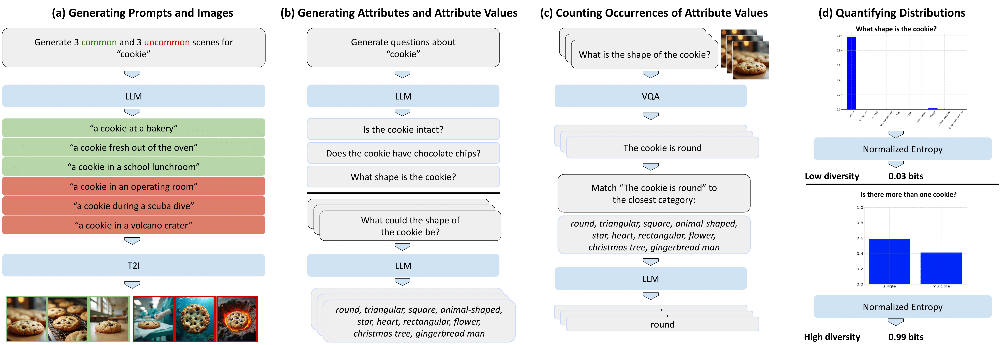

# GRADE: Assessing Output Diversity in Text-to-Image Models

We introduce **GRADE**, a method for assessing the output diversity of images generated by text-to-image (T2I) models. Leveraging Large Language Models (LLMs) and Visual Question Answering (Visual-QA) systems, GRADE quantifies diversity across concept-specific attributes by estimating attribute distributions and calculating normalized entropy.

In the [paper](https://arxiv.org/abs/2410.22592), our findings reveal substantial homogeneity in T2I outputs, with low diversity observed across all 12 models tested. Surprisingly, larger and more prompt-adherent models exhibit reduced diversity. We hypothesize that this low diversity stems from reporting bias in the training data. Additionally, we demonstrate that the diversity in the LAION dataset closely corresponds to the diversity of Stable Diffusion 1 and 2 models, which were trained on it.

## Project Links

- [**Project website with interactive results**](https://royira.github.io/GRADE/)
- [**Paper**](https://arxiv.org/abs/2410.22592)

## How does GRADE work?

### The GRADE pipeline


### Quantifying a distribution with normalized entropy


### Installation

To use GRADE for assessing the diversity of your text-to-image model outputs, follow these steps:


1. **Install Dependencies:**

    ```bash
    pip install -r requirements.txt
    ```

2. **Set Up an OpenAI key:**
    Create a file called oai_key.txt and put it in the base directory, it should contain your OpenAI key.


### Methodology


```python
# Example code snippet
import grade

# Load your text-to-image model outputs
images = grade.load_images('path/to/images')

# Assess diversity
diversity_scores = grade.assess_diversity(images)

# Display results
print(diversity_scores)
```

## Cite Us

If you use this code or our results in your research, please cite as:

```bibtex
@misc{rassin2024gradequantifyingsamplediversity,
  title={GRADE: Quantifying Sample Diversity in Text-to-Image Models}, 
  author={Royi Rassin and Aviv Slobodkin and Shauli Ravfogel and Yanai Elazar and Yoav Goldberg},
  year={2024},
  eprint={2410.22592},
  archivePrefix={arXiv},
  primaryClass={cs.CV},
  url={https://arxiv.org/abs/2410.22592}, 
}
```
